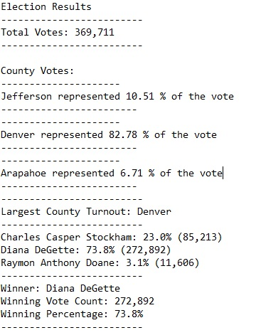

# Election_Analysis

## Overview of Election Audit
The Colorado Elections Board asked us to perform an election audit of a congressional election. That audit is composed of : 
1-The number of votes that were casted in that election.
2-A breakdown of the number of votes and the percentage of total votes for each county in the precinct.
3-The county that had the most votes
4-A breakdown of the number of votes and the percentage of the total votes each candidate received.
5-The candidate who won the election, its vote count and its percentage of the total votes

## Election-Audit results
In that congressional election 369,711 votes were casted. The precinct is divided into three counties : Jefferson, Denver and Arapahoe. In the Jefferson county, it's 38,855 votes that were casted.It represents 10.51% of the total votes. It was 306,055 votes in Denver (82.78%) and 24,801 votes in Arapahoe (6.71%). With those results, we can see that the Denver county had the most votes. The three candidate were: Charles Casper Stockham, Diana DeGette and Raymon Anthony Doane. Mr. Stockham received 23% of the votes (85,213), Mrs. DeGette got 73.8% of the votes (272,892) and Mr.Doane had 3.1% of the votes (11,606). The winner is Mrs.DeGette with a majority of 73.8% of the votes. The image below wraps everything up in that paragraph. 

## Election-Audit Summary
With little modifications, this script could be used for any election. First, we could change the dataset by having this line : 
file_to_load = os.path.join("resources", "election_results.csv") 
to this generic line : 
file_to_load = os.path.join("name of the folder", "name of the file ")

You might also have to change the name of the variables to make it clearer. For example, we had these variables : 
county_list = []
county_votes = {}
In a presidential election, you would have to change county_list = [] to state_list[] and county_votes{} to state_votes{}. 

Those are just examples of how we could make our code more generic. 
